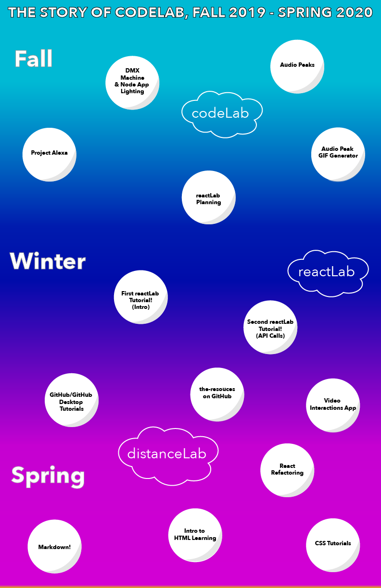

# Details: 
## CodeLab (fall 2019):
1. [Project Alexa](http://show.learninglab.xyz/work/three-peas/project-alexa)
2. DMX Machine & Turning on Lights with a Node App
3. [GIF Machine](https://github.com/mkuzmick/gif-machine)
4. [Audio Peaks](http://show.learninglab.xyz/work/three-peas/project-audio-peaks)+ [GIF Generator](http://show.learninglab.xyz/work/three-peas/GIF-showcase)
5. The beginnings of reactLab
## ReactLab (Winter 2019/Spring 2020)
1. [Create React App Starter](https://github.com/learninglab-dev/ll-createReactApp-starter)
2. [React Presentation](https://docs.google.com/presentation/d/1XWGA0pqDEJEY09ajDMe5E6As-_JUo2LFP8KIpqY84Ks/edit?usp=sharing)
2. [First Tutorial](https://github.com/learninglab-dev/ll-first-reactLab)
3. [Second Tutorial](https://github.com/learninglab-dev/ll_secondReactTutorial)
4. [Video Interactions App](https://github.com/1aurend/video-interactions)
6. ReactLab: Refactoring
7. [GitHub Desktop](http://resources.learninglab.xyz/simple/people/sophie-b/githubdesktop)
8. [CSS Tutorials](https://github.com/learninglab-dev/learn-css)
9. [Sarah & David’s Intro to HTML Learning](https://docs.google.com/document/d/1HWkvbSuxcGxno-eFLfJPmV-E76jTkXzr_mkSbwHiJfA/edit#heading=h.d7af2xijff6t)
