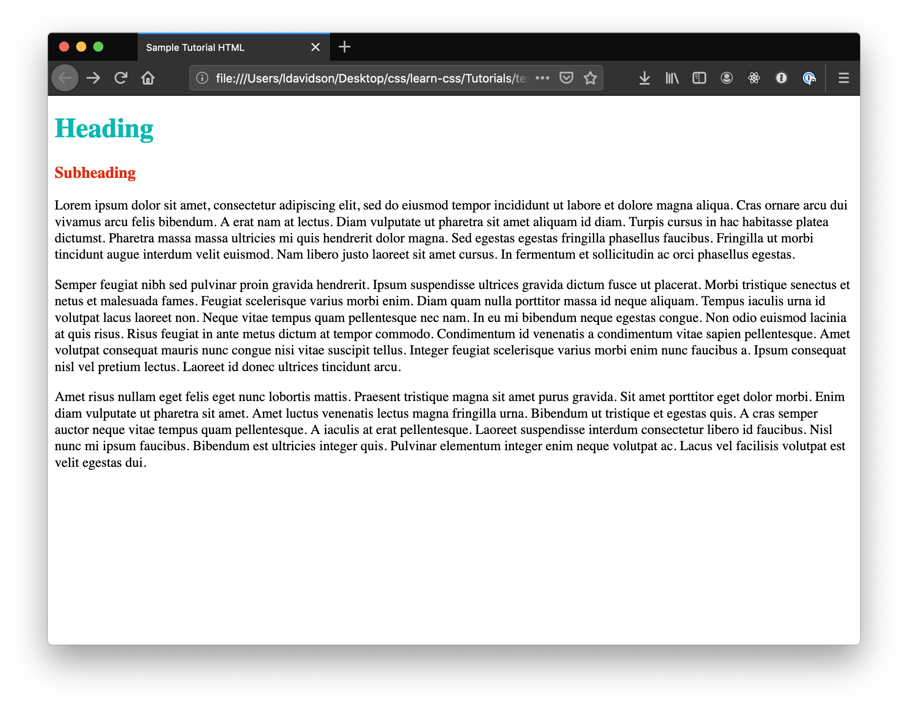
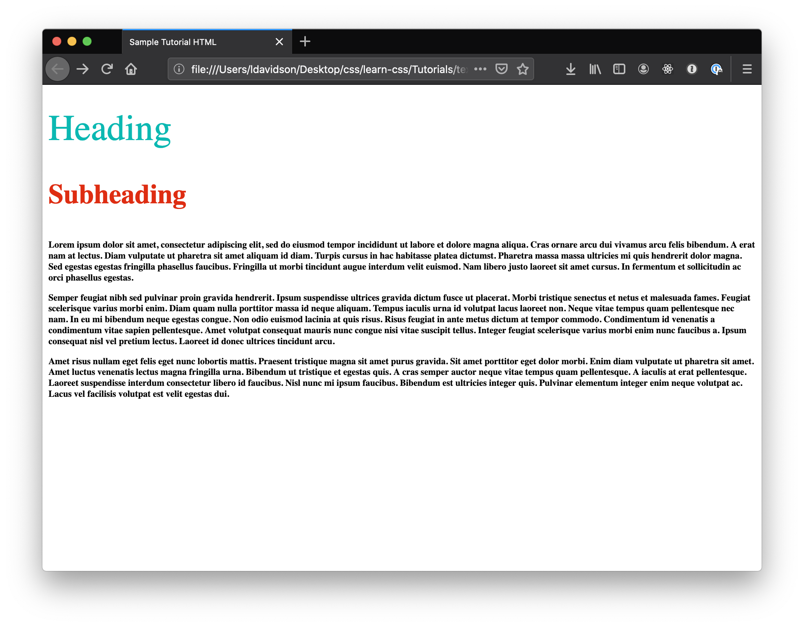

# Text Styling Basics

&nbsp;  
There are lots of things you can do with text in CSS! We'll just cover a few key properties in this mini-tutorial, but once you understand the basics, you should be able to look up additional text formatting properties and apply them:

- [Color](#color)
- [Size & Weight](#size--weight)
- [Shadow](#shadow)
- [Font](#font)
- [Alignment](#alignment)
- [Decoration](#decoration)

Here is a good [guide to text styling](https://developer.mozilla.org/en-US/docs/Learn/CSS/Styling_text/Fundamentals) with a built in editor at the bottom for trying things out.

---

## Starting Points

This mini-tutorial just covers CSS, so we'll assume you have HTML with a variety of text elements to style. You'll want to have text with at least these three tags:
```html
<h1>Heading</h1>
<h3>Subheading</h3>
<p>This is a paragraph. Here we'd want a larger chunk of text to style.</p>
```
You can use [this demo html](./starter.html) if you don't have your own.

---

## Adding a Stylesheet

If you don't already have a stylesheet in your project, the first thing you'll need to do is create a CSS file, `styles.css`, in the same directory as your HTML. If you're using the demo HTML in this repo, there's a blank [`styles.css`](./styles.css) ready for you.

We'll then add the following link to our CSS in the `<head>` of our our HTML file:
```html
<link rel="stylesheet" href="styles.css">
```
In the demo HTML, this is already done for you, but you should still take a look to make sure you know where the stylesheet link goes for future projects.

---

## CSS Text Properties

All of the following code, or any of it that you choose to use, goes in your `styles.css` file. Note that in this mini-tutorial, there is no "final" product. Instead we'll try out a variety of text styles that you might want to use in your own projects.

### Add Selectors

Before we can make any changes to our text, we need to add the relevant "selectors" to our `styles.css`. Selectors are what the various HTML elements like `p` and `h1` are called in CSS.  

In the demo HTML, we only have three types of text elements, so we'll add those three selectors to our styles:
```css
h1 {

}
h3 {

}
p {

}
```
If you have more in your HTML file, go ahead and add those in as well.

### Color

First we'll add some color. Some basic colors like `blue`, `black`, `purple`, etc. can be used by name, but you can choose any color by finding its [hex color code](https://www.google.com/search?q=color+picker). Here's the demo text with some random colors:
```css
h1 {
  color: #0bb8b2;
}
h3 {
  color: #de2d12;
}
p {
  color: black;
}
```


### Size & Weight

Next, we'll set our font size and weight. You can use a [variety of units](https://developer.mozilla.org/en-US/docs/Learn/CSS/Building_blocks/Values_and_units) for size, including absolute units, like pixels `px`, and relative units, like percent `%`. Just be careful when using relative units, making sure that you know what the size is being calculate relative to. We'll stick with pixels for this demo:
```css
h1 {
  color: #0bb8b2;
  font-size: 48px;
}
h3 {
  color: #de2d12;
  font-size: 36px;
}
p {
  color: black;
  font-size: 12px;
}
```
Font weight determines how bold the font is. You'll typically use only `regular` or `bold`, but you can also use numerical values from 100-900, if you want more precise weights. Heading elements are also bold by default in most browsers.
```css
h1 {
  color: #0bb8b2;
  font-size: 48px;
  font-weight: 100;
}
h3 {
  color: #de2d12;
  font-size: 36px;
  font-weight: 800;
}
p {
  color: black;
  font-size: 12px;
  font-weight: bold;
}
```

