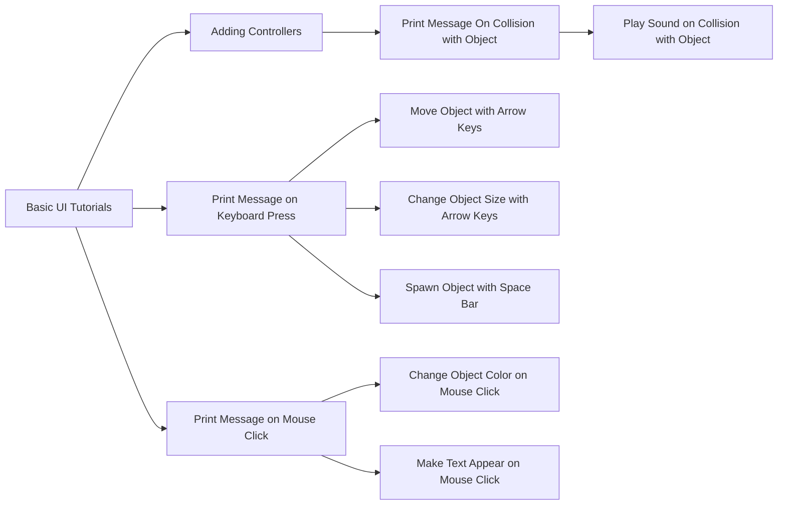

# realityLab Unity Scripting Tutorials

A series of tutorials and resources around learning to write C# scripts for the Unity game engine that help you make cool things happen in your game/project.

These tutorials are modular - they can be pursued in any order. Below is merely a suggested sequence for the indecisive uninitiated!

## Basic UI Tutorials

**[Tiniest World.](https://docs.google.com/document/d/1HICcZzxWDP6cL9Y6xMmYOgyY1Ym7-_HHbYp5XHS6zbQ/edit?usp=sharing)**  Get your first, tiny Unity world up and running in no time! A fun, fast first foray into Unity.
 
**[Castle in the  Sky.](https://www.youtube.com/watch?v=14N5oHBaOSE&feature=youtu.be)**  Build a Unity scene fit for a monarch while getting a tour of the user interface and learning basic transform tools, camera manipulation, and how to add objects.

## Adding Controllers

**How to Add a Standard Assets Controller.** Need an avatar in your scene that your player can control?  Learn how to add the two kinds of controllers that come free with Unity's Standard Assets package.

**[How to Make Your Own Simple Controller.](https://www.youtube.com/watch?v=C0r451Oj540)** Need an avatar in your scene that your player can control, but don't want to use the Standard Assets? Learn how to make any game object (in this case, a cube) into a controller with simple movement capabilities.

## Making Things Happen with the Keyboard

**[Print Message on Keyboard Press.](https://youtu.be/2Vdnk1WNIHI)** Get Unity to send you a message in the debug log whenever you press a key on the keyboard.

**[Move Object with Arrow Keys.](https://www.youtube.com/watch?v=C0r451Oj540)** Control an object's cardinal movement using the arrow keys. Useful for making your own basic controller if you don't want to use the Standard Assets ones!

**[Change Object Size with Arrow Keys.](https://www.youtube.com/watch?v=NaKjmQqp5uA&feature=youtu.be)** Make an object grow or shrink by pressing the arrow keys.

**[Spawn Object with Space Bar.](https://www.youtube.com/watch?v=5zpGC8uaCl4&feature=youtu.be)** Make an object appear in the scene when the space bar is pressed - in this case, a growing tower of neatly stacked cubes.

## Making Things Happen with the Mouse

**[Print Message on Mouse Click.](https://youtu.be/2Vdnk1WNIHI)** Get Unity to send you a message in the debug log whenever you click the mouse. 

**Change Object Color on Mouse Click.** Make an object change color when you click the mouse *anywhere on the screen*.

**Make Text Appear on Mouse Click.** Make a text box or similar pop up when you click on a *specific object* in the game world.

## Making Things Happen on Collision

**Print Message on Collision with Object.** Get Unity to send you a message in the debug log whenever your controller runs into an object in the game world.

**Play Sound on Collision with Object.** Get Unity to play a sound effect, dialogue clip, song, etc. when your controller runs into an object or zone in the game world.

## Other Resources
**[The Unity Scripting Troubleshooter.](https://harvard.az1.qualtrics.com/jfe/form/SV_0Drc0IHiLqermkt)** Code not working? Work through your problem with the aid of this troubleshooting tool to catch the most common kinds of coding errors.

---

> A major project of the Unity/C# arm of realityLab during Fall 2019,
> with assists by Anna White-Nockelby, Clarisse Wells, Ceci Mancuso, and Lauren.
> 
> 
> 
> 
> Written with [StackEdit](https://stackedit.io/).

<!--stackedit_data:
eyJoaXN0b3J5IjpbMTI1ODMxNTg0NiwxNjE0MTQzODg4LC04MD
I4NjI0MTksLTMxMjE5Njk3MywtMTQ0NDIyODk0MCw5NjMxNTAz
ODYsLTE3MzkzNjk1MzUsMzA0ODQ0MzEzLC00NjAzMDE1MiwxNj
YxMzAyNjgzLC0xNDM4NTUwMjA3LC04Nzk3MTUyODcsLTIwNTc3
MjkxMDMsMTAwNzkxOTMyMiwxMTU4OTA2ODAyXX0=
-->