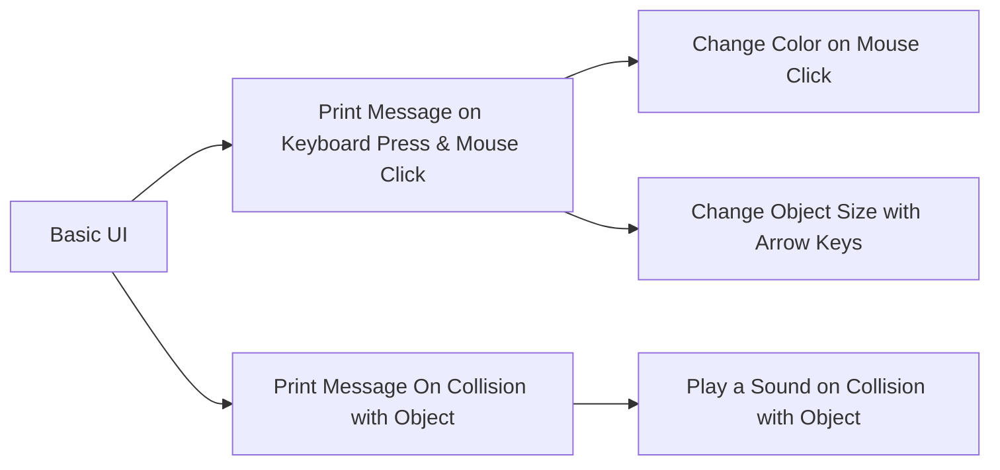

# realityLab Unity Scripting Tutorials

A series of tutorials and resources around learning to write C# scripts for the Unity game engine that let you make cool things happen in your game/project.

These tutorials are modular - they can be pursued in any order. Below is merely a suggested sequence for the indecisive uninitiated!

## Basic UI Tutorials

 - [x] **[Castle in the  Sky.](https://www.youtube.com/watch?v=14N5oHBaOSE&feature=youtu.be)**
       Build a Unity scene fit for a monarch while getting a tour of the
       user interface and learning basic transform tools, camera
       manipulation, and how to add objects.

Printing Messages

## Print Messages on Keyboard Press & Mouse Click

A major project of the Unity/C# arm of realityLab during Fall 2019, with assists by Anna White-Nockelby, Clarisse Wells, Ceci Mancuso, and Lauren.

> Written with [StackEdit](https://stackedit.io/).
<!--stackedit_data:
eyJoaXN0b3J5IjpbLTIxMDc0MDQyODRdfQ==
-->