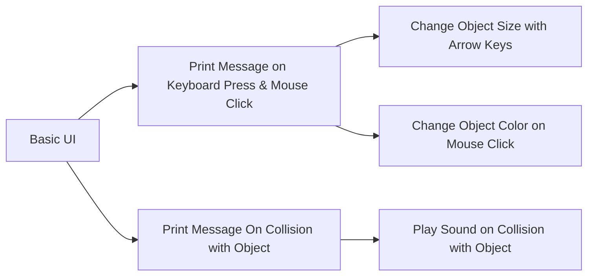

# realityLab Unity Scripting Tutorials

A series of tutorials and resources around learning to write C# scripts for the Unity game engine that let you make cool things happen in your game/project.

These tutorials are modular - they can be pursued in any order. Below is merely a suggested sequence for the indecisive uninitiated!

## Basic UI Tutorials

**[Tiniest World.](https://docs.google.com/document/d/1HICcZzxWDP6cL9Y6xMmYOgyY1Ym7-_HHbYp5XHS6zbQ/edit?usp=sharing)**  Get your first, tiny Unity world up and running in no time!
 
**[Castle in the  Sky.](https://www.youtube.com/watch?v=14N5oHBaOSE&feature=youtu.be)**  Build a Unity scene fit for a monarch while getting a tour of the user interface and learning basic transform tools, camera manipulation, and how to add objects.

## Printing Messages with Common Inputs
Learn how to print messages to the console using three common forms of input. Useful for debugging, and as a first step / foundation for most other scripts.

**[Print Message on Keyboard Press & Mouse Click.](https://youtu.be/2Vdnk1WNIHI)** Get Unity to send you a message whenever you press a key on the keyboard or click the mouse. 

**Print Message on Collision with Object.** Get Unity to send you a message whenever your controller runs into an object in the game world.

## Coding Other Outputs
Learn how to code outputs other than message printing. Any of these outputs should be combinable with any of the inputs covered (keyboard, mouse, and collision) - the following are merely examples.

Change Object Size with Arrow Keys.

Change Object Color on Mouse Click.

**Play Sound on Collision with Object.** Get Unity to play a sound effect, dialogue clip, song, etc. when your controller runs into an object or zone in the game world.

## Other Resources
**The Unity Scripting Debugger.** Code not working? Work through your problem with the aid of this troubleshooting tool to catch the most common kinds of coding errors.

---

A major project of the Unity/C# arm of realityLab during Fall 2019, with assists by Anna White-Nockelby, Clarisse Wells, Ceci Mancuso, and Lauren.

> Written with [StackEdit](https://stackedit.io/).
<!--stackedit_data:
eyJoaXN0b3J5IjpbMTU2Njc4MDgxMywxMTU4OTA2ODAyXX0=
-->